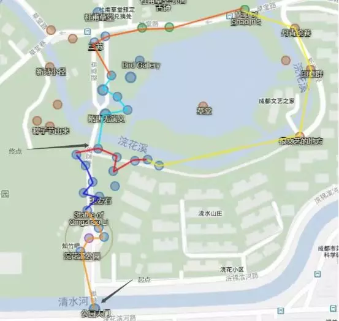

# 成都夏季IFS注意事项

各位特工你们好，欢迎各位参加2019年7月6日于中国大陆地区举办的各场IFS。在您于当日前往活动前，有以下事宜还请各位确认：

1.  请确保各位在前往ifs现场前已经于FevGames上进行了RSVP。基于中国大陆的特殊环境，NIA将以此为基本参照为各位发放牌子，并非过去意义上的hack签到po。

2.  成都7.6IFS现场签到时间为下午两点开始，下午三点开始现场ap翻倍，到达现场后，请确保您完成了以下几件事：

1）  hack签到po，以hack出一个有关于ifs的media为准。

2）  于两位poc处签到，登记您的初始ap。

3）  在poc的组织下合照，一张合格的IFS现场合照要求最低人数10人，其中至少包括3蓝3绿。这张照片将同样用于核实签到和发牌依据。

3.  接下来的下午三点到五点，您可以尽情享受ingress的各种乐趣：刷足5000ap。我们并不要求您滞留于某地，但请于ifs结束前回到签到地点。

4.  在活动结束后，请确保您完成了以下几件事：

1）于两位poc处签退，并登记结束时的ap。

2）等待半小时后出现的补仓po。

以上，供各位参与者们参考，祝各位度过一个愉快的周末。

活动地点：浣花溪公园

附近交通：可乘坐地铁至2/4号线到中医大省医院，在中医附院站乘坐58号公交车。

集合PO：  屈原跳河

Intel链接：https://www.ingress.com/intel?pll=30.659692,104.025664&z=18

NPC：**@icecreeeeeam**，**@dididididisco**

## IFS • 任务

任务路线如下：

小编叨叨叨一些注意事项：  

1. 因为IFS规则（每单场人数蓝绿总数不超过80人，否则会出现玩家无法获得活动牌子）以及报名人数（第一场已经爆啦，所以大家还有想要报名的请等待我们后续的文章哦）的原因，我们目前正在申请第二场IFS的举办地点，当天我们会需要对活动的人数进行分流，poc会推荐玩家所参加的活动场次，以保证参与玩家都能获得牌子。相关的详细信息我们会在本次IFS的TG频道里面持续为大家更新，点击阅读原文可访问频道消息。
2. 本次签到方式为电子签到，具体签到方式我们还在测试，届时会在频道里面讲解。
3. 因为浣花溪场次的报名人数已经超过80，故此不放出报名链接，后面新场次（东郊记忆）报名链接开放过后我们会在公众号已经TG频道里面放出。
4. 当然，最最重要的提醒就是一定不要错过在夏日里我们相遇。

