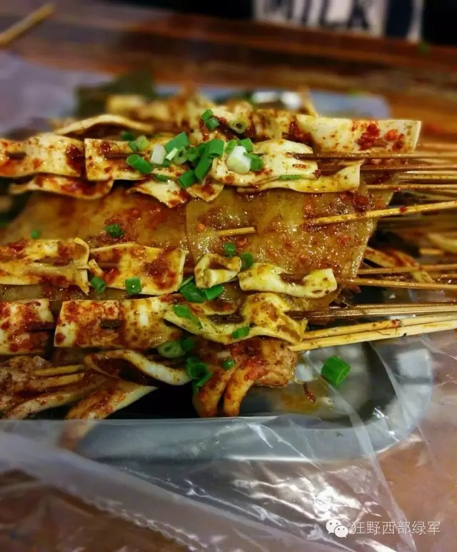
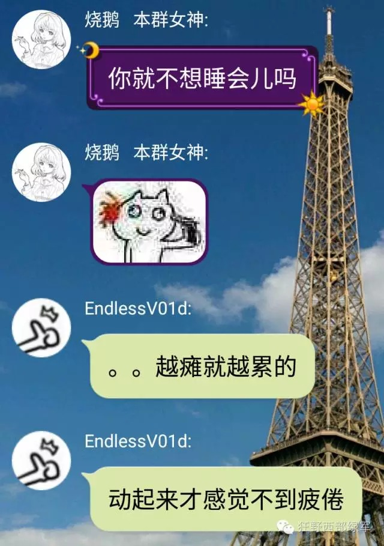
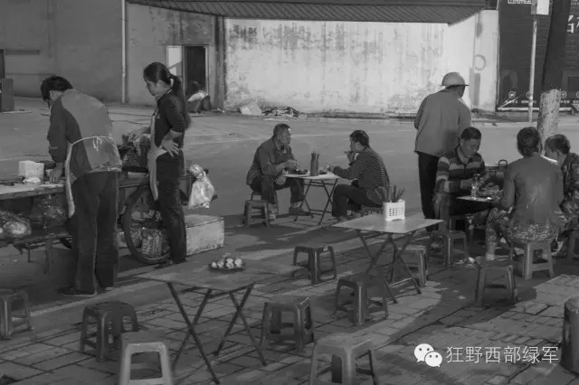

# 夜色成都 To 早安成都——记一次通宵肝任务的经历

> 第一次写推送，请容许我表达下难以平复的激动心情！我会以时间以及相关截图来记述（口水话）此次经历（中间会有高能放毒，请各位观众做好准备）

## **肝之前**

5.28是台南anomoly活动，成都有幸承接了内陆充电组之一的委任，并成立了相应的讨论组召集并商议此次事件。鉴于5.28活动的充电是在周六中午进行，一群热血沸腾（无所事事）的充电组成员，开始讨论早上做任务的相关事宜。（由于本人不知道为何早上变成了通宵，并且该讨论组的聊天记录过于过于长，索性懒得去找了）

一番胡乱讨论之后，4个人的车发车啦！！！@Duskpiper @BurningSwan @GhostPioneer@toudolyn

由于烧鹅学姐（@BuringSwan）排练活动，土豆（@tudoulyn）和我（@GhostPiper）决定去做宽窄巷子的熊猫黑牌任务，而车神（@DuskPiper）去做the way to explore

做完各自的任务之后，我们到了夜色成都任务开始的地方耍都附近的【卧龙园】等待烧鹅学姐的到来，期间因为土豆突然有事需要离开，不能愉快得和我们肝任务了（sad  face）。

## **肝之中**

等到11点钟，烧鹅学姐和@Endlessv01d（一直与我们同在的肝帝）一同从江安过来了，他去做熊猫牌任务，而我们也开始在夜色的笼罩下做夜色成都了。（据说夜晚和夜色成都更配哦！）（其实蓝色那段应该是在公交上完成的，但是半夜哪里有公交啊！）

（附上行动的大致路线）前面14个的行动（红色那段）还是挺正常的，除了有些地方因为晚上不开放绕了些路，不得不说，兰桂坊和九眼桥的夜景还是挺不错的（这是本人第一次去兰桂坊）

正要做下一个任务的时候，看到@smyjh正在望江公园往就近的po拉菊花，本来疲于步行的三个人跟打了鸡血一样疯狂得奔向菊花，用US磨掉盾后，以迅雷不及掩耳之势炸掉了portal,最终由烧鹅学姐成功拿到了近10k的ap（羡慕）

对于即将开始的后半段uber行程，三人开始了无限的憧憬和饥饿，于是大家开始愉快得撸串

由于uber司机车技十分娴熟，任务开始不久，学姐就~~成功地~~错过了一个po，大家就开始编各种奇葩的理由让师傅掉头，师傅一脸蒙蔽地以为我们落了什么东西，但是当烧鹅学姐hack成功之后，我们立即要求其掉头，然后司机更加蒙蔽地看着我们，我们只好尴尬得说，你就当我们是无理的人，尽提些无理的要求吧，QAQ（鉴于解释这游戏不是能够一句两句的事）。但天不遂人意，做完了一个任务之后，接下一个任务的时候大家都不约而同地出现了失误，我们没好意思再让司机再次掉头，索性在青羊宫，青羊宫！下了车！摸完青羊宫的po之后，下个po出现在2km远之外，然后有了以下对话

在环一环路的过程当中，这个医院的突然出现让我们三人笑了许久，也算是对我们最好的慰藉了吧

早上7点，访问完【1956成都原点】这个po之后，身心俱疲的三人找到了就近一家麦当劳休息并准备出发前往充电地点，于是有了本文开头的一幕。此次任务大概行走30+km，并得到了各阵营agents的关怀，并对所有半夜惊受过攻击报告的agent表示抱歉！

## 另记一位肝帝

一位一直与我们同在并且肝到10点的肝神,MAY THE XM BE WITH U! Enlighted!

## 最后记·车神的照片

