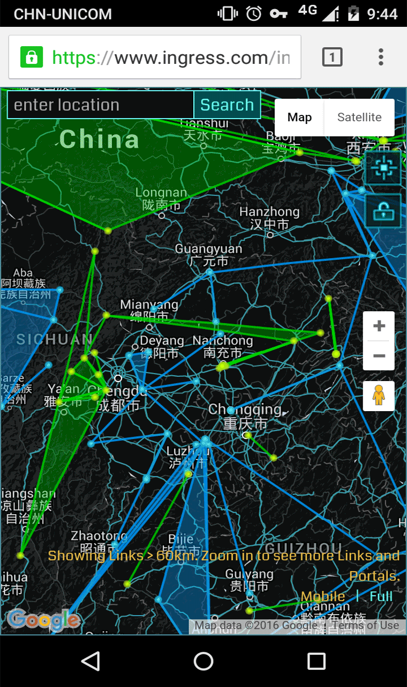
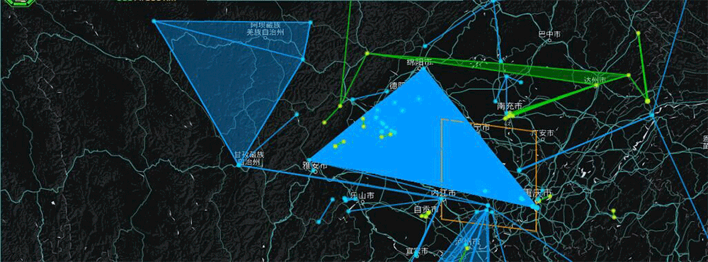

# 听说，FS流行盖场了？

> 笔者表示最近每日搬完砖回寝室都发现校园网挂了，于是这篇迟了很久= =

五月底的时候，距离成都FS也近了，大伙也蠢蠢欲动，不希望FS的时候百花潭是被盖着的，就提出去打掉简阳的众多link，我有幸接下了简阳的锅。也不知是谁提出可以顺势盖一发成都，便一发不可收拾，很快便理出了大致的行动方案，但还并未确定人员。数日后，动起来才不会感到疲倦的@EndlessV01d表示他愿意去跑一趟顶点，@Foniente表示他也愿意参与行动，至此行动敲定。  

FS前一日一早，@EndlessV01d登上了前往南充的动车，@DuskPiper在前往青神的路上，@GhostPioneer与@petergogo一同前往新津，@Foniente驱车前往新津的顶点，@CharlieQ前往遂宁，@Colderplay乘高铁前往简阳。

待大家到位后，一声令下，@Colderplay清理了简阳的link，@GhostPioneer断开了新津的link，@CharlieQ开始清理遂宁障碍，@EndlessV01d与@Foniente分别在南充与新津建立连接，@Foniente黑牌到手，随后@EndlessV01d也获得了他的黑牌，其余agent也继续清障并补刀。

行动完成之后，各位agent也都踏上了回城的路途。

我表示还要赶回学校参加组会（

在开完了一下午的组会之后，打开游戏，被水淹没，不知所措（还挺卡）。大伙为了解开蓝盖，不让fs卡卡地进行，临时讨论，确定了人手去解盖（并再次盖上）：  

@Colderplay、@EndlessV01d、@BurningSwan前往新津建立link，@cdecl前往灵岩寺清障，@darksoulfire在绵阳清障，@MoodySyne在南充建立link。

@cdecl前往灵岩寺的路上有山路塌陷，而且视线不佳，在这里提醒各位agent**一定，一定，一定**要记住：

**安全第一！安全第一！！安全第一！！！**

制定计划的四小时后，时间一到，大家一同操作，烧鹅学姐成功收入黑牌一枚。

随后这个盖子被蓝军解开，成都又回到黑军的地盘（咦

这一天成都经历了绿盖、蓝盖、再绿盖，最终回归平静，为第二天的FS预热得厉害。

FS当天早上，@aiaiaiaia23前往庐山进行清理（并刷了一波mu）

随后赶回百花潭参与FS活动。

一颗赛艇的FS~（以后改成First Weekend好了（笑

