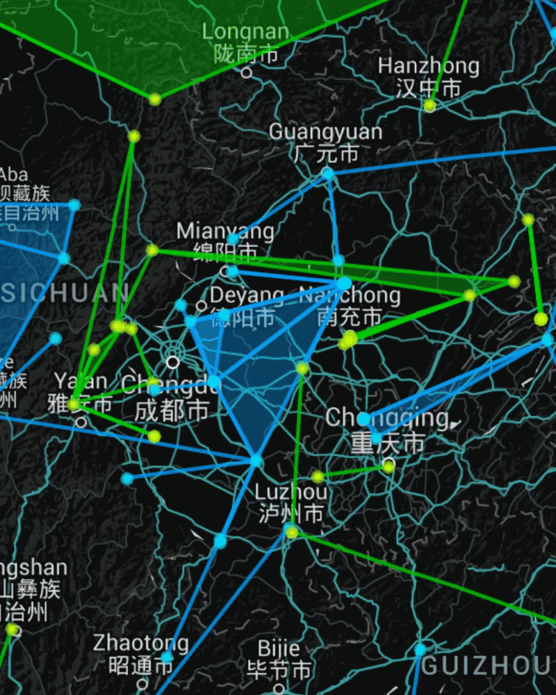

# 川渝端午联合行动--粽子计划

_**Run,Forrest run!**_

_**在雨中我奔跑着,向最后一个障碍点冲刺,像个疯子一样!**_

这次川渝联合行动,前期策划与intel指挥由@MoodySyne负责,行动组特工有@FTime@Foniente @CharlieQ @hpy7617 @zhcntiangang.

6月9号,农历五月初五,端午假期的第一天早上@MoodySyne完成了南充到万州的障碍的清理,当天晚上@hpy7617冒雨自残清理了泸州的障碍,保障了第二天计划的重头戏能如期上演!

6月10号上午9:40,各地方特工均已就位.@MoodySyne一声令下,@FTime毒掉内江火车站,@Foniente打掉简阳的障碍,@zhcntiangang毒掉重庆block顶点.上班偷跑出来的@hpy7617从泸州连接到茂县.

我接的是清理合川障碍的锅,合川的障碍点总共有三个地方,两两之间直线大约1公里,天还下着雨.三个点清障顺序是排在@hpy7617Field前面的,尝试各种保护link无果,倘若有蓝军在我清理三个障碍点的中途拉出新的block link,那这次行动很可能就GG了,但行动组最后决定赌一把!

在我清理完第一个位于人民公园的障碍后,上了出租车前往第二个障碍点,在乘车过程中还不忘对司机进行了一波安利\(没错,这游戏叫英格瑞斯!司机问我连完Field有现金奖励没?\),5分钟后在出租车上完成了清理,然而在去往客运中心障碍点的时候发生了堵车,行动组语音频道不停有人问CharlieQ到哪儿了,显然我成了那个关键先生.这是距离客运中心还有500米的距离,果断下车开始跑,因为我的提前下车安利司机失败.在我完成了客运中心清障后@hpy7617开始建立Field并顺利完成,hpy开心地说在连完那一刻看到了颤抖的scanner! Field人口达47M!

至此行动完成了预期目标,并获得了车神@DuskPiper启蒙称赞buff!

