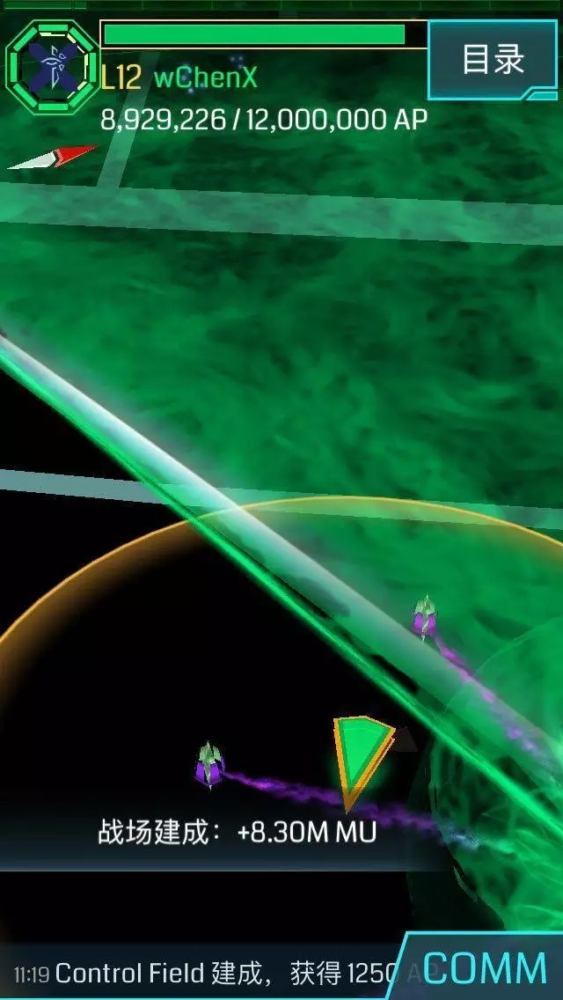
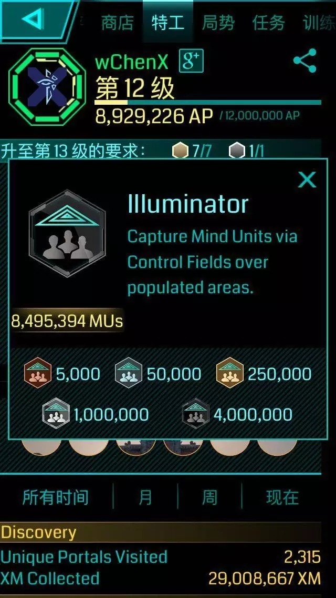
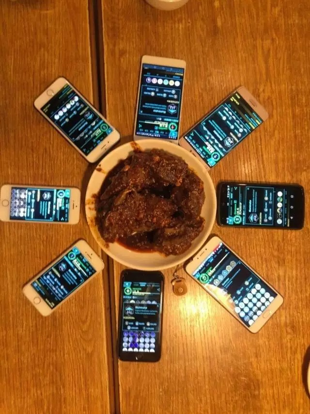

# 麻麻叫我拿黑牌

大家好，我是萌萌新@wChenX，这次由我来写个战报，记叙一下成都绿军2017年第一次行动，代号：亚瑟王不是妹子么？

事情的起因是这样的，由成都新任战略大佬二萌发车，我们在都江堰盖他个一个亿，于是新的车队就此组建。

在理清楚行动人员和内容后，各项安排传达到位，1月15日清晨，我们一行人在火车站集合，乘坐103次列车前往都江堰。

9:30左右抵达都江堰火车站，随后乘坐当地的4路汽车前往计划的第一个Po。

在汽车上，我因为汽车颠簸和其他各种原因（情况太复杂，此处省略一万个字）出了今天第一个log，于是开始了今天的背锅之旅。

好在一切顺利，一行人在都江堰面馆一顿饱餐后，收到了南部清障友军@quanchangzuijia，和前往青城山清障的大佬@ghostowns的任务完成信息。开始了紧凑的拉多重发黑牌行动。第一层由@hermittttt连出，拿到了XXXMU（小编：王胡豆忘记了），随后按计划依次进行，虽然中间出现了@price32768由于兴奋连错link，毒Po重连，众大佬抢占upc等小插曲，我们还是顺利的完成了计划，总共盖了xx层（小编：王胡豆又忘记了），共发出6块崭新的黑牌。  

随后前往西部的二萌和饺子加盖了XX层（小编：他懒）。本次行动圆满成功。前往都江堰的agent们再次约饭，并开展了召唤兔头的神秘仪式，随后返回成都。  
 

清障组：

@quanchangzuijia @Ghostowns @ZtwoM @jiaozzzzzz  
intel组：  @BelethBathin  
都江堰组：AspIsoantigenIG 

都江堰组：

@Hermittttt @swjtuStalin @price32768 @kimoooooo  
@wChenX  @Ghostowns @ysw2968  
映秀组：  

@ZtwoM @jiaozzzzzz 

