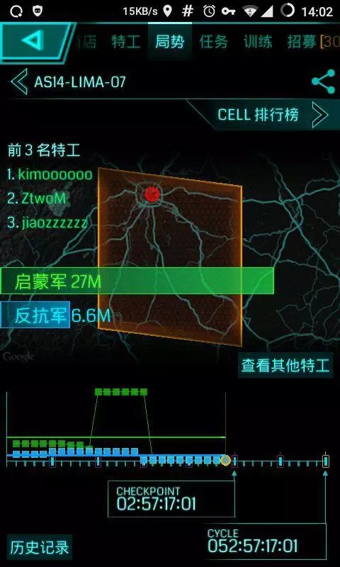

# 你们这些黑牌菊苣哦

> 编者按：昨日我们推送了两篇1月15日黑牌行动的相关战报，文章发出后陆陆续续有旁友反馈一些问题。其中，特工二萌@ZtwoM十分热心，向我们投稿以还原现场，同时补充更多细节。其认真的态度就如他日更tg学习小组频道（[https://t.me/woaixuexi）一样，实事求是兢兢业业。（巴巴掌）](https://t.me/woaixuexi）一样，实事求是兢兢业业。（巴巴掌）)

## 起因

二萌：“放假好无聊啊，好想单人盖个成都。”

> （所以前几天自己去南西三环到第一绕城三圣乡清了一波，无意清了@thFruitup大佬成就被黑脸问候了！吓死二萌了，按照dalao定律，肝帝成就都是黑不了，二萌连铂金都没有，主成就死于成懒新晋肝妹@lilyvs）

然后二萌就规划了一个华阳-金堂-都江堰的CF。

哪知温江有个新晋大爷肝帝@Hezlie西郊百联了一通（现在温江大爷都在研究多重了，真是时光飞逝，肝帝咸鱼交替）。

附:温江大爷的多重截图图。

这时候，黑牌菊苣背时兼成绿肝帝生产线背时发话了 @BelethBathin ，要搞就搞个大事情，温江西郊百联根本过不去，清障压力太大了（其实就是懒）。

好吧在背时大佬的指引下，就利用现有底边（一脸懵逼-石雕）作为底边，然后都江堰发车。（小编：背时说都是二萌策划的，对于这俩人相互谦让公开秀恩爱的行为我很有意见啊）

规划出来以后，然后列清障列表。

好像没二萌什么事了（钥匙没我事，清障也没我事），哎呀看一下资料，MU早就黑了，饺子@Jiaozzzzzz 也早就黑了，都江堰也去过了，然后二萌就和饺子愉快约定去映秀一日游。

作为自主黑牌的菊苣背时（详情参见之前推送：1月5日南充黑牌扶贫攻坚计划）当然不屑于去都江堰拿那么一点MU，就担当行动总指挥兼intel。

说到一点点MU，让我想起了战略大佬亚瑟王@ysw2968单人盖内蒙自助黑牌的雄心壮志（详情参见：20MU萌新黑牌记），所以他也半路上车。

上车的还有成绿传奇玩家兼吉祥物的可膜@kimoooooo，可膜可谓三年升9约饭型战略玩家。MU也没黑，当然发车少不了可膜。

## 行动前夜

什邡德阳的清障是早就断掉了，剩下的新世纪广场@quanchangzuijia预计15号上午去清掉，大石磨@Ghostowns准备15号先去青城山清障然后再去都江堰会合。

剩下双流障碍华体犀牛就交给了制霸城南一霸兼卡牌大师兼肝帝兼成绿下一个16级玩家的老玩具@oldtoy。老玩具提前就去毒了，真是辛苦了，那地方交通不便坑哭/\(ㄒoㄒ\)/~~了老玩具。（小编：老玩具说等了一小时公交）

二萌也提前一天买了去映秀的车票。（当然去映秀肯定有小心思，一没去过，二有PO啊！作为一个优秀的Agent怎么能放弃UPC）

## 行动当天

第二天15号二萌早早来到茶店子与饺子会合（吐槽一下，为什么这家德克士如此傲娇咖啡不能换成豆浆！！！），搭上了开往映秀的车，一路上乘务（收票的）都在安利怎么能不去水磨镇呢，作为一个优秀的Agent马上打开Portal地图查看有无PO（有PO，好，下一个考虑一日游的地方）。

此处略去500字。。。

经历了2个小时的颠簸，终于踏上了映秀这片受过伤的土地，小镇分外安静（善用搜索：5.12汶川大地震）。

在小镇晃哒了两圈，虽然重建了，但伤疤依旧可见，顺路看了一下小镇PO的分布，镇很小PO不足20个。抵达小镇都10点徐，都江堰的黑牌菊苣大佬们早已开始了MU的狂欢（详情参见：1月15日自助黑牌计划）。

萌新二萌跟饺子只能眼巴巴的看着，然后找了一家有饭PO（5兄弟）的小店填饱肚子。

原生态的腊肉和有机素菜当然不能少，就不放毒了（菜太好吃了，根本就没拍）。

饭饱之后闲来无事，听说都江堰组已经连完了，就产生了以下对话。

二萌：“好像你有懵逼的钥匙！“

饺子：“好像你有石雕的钥匙！“

。。。（然后会心一笑）

就这样一拍脑袋准备xjbl两层吧（这才是真相！！！）。

就随便xjbl竟然有9.4MU，吓死萌新了！就这样莫名其妙的上了大新闻。

饺子在二萌加成下出了红桶！

然而二萌当天什么VR也没有摸出，真是好气啊！

然后又像一个普通游客在山上参观了套路型建筑地震纪念博物馆，顺便还中了一个成就！！！

然后就像个小学生一样蹦蹦跳跳的愉快回家了，完成了一日游，不知怎么的就上了地区排行榜，可膜竟然是当天MU最高的男人！

## 总结

Intel兼总指挥总策划：BelethBathin（BB说：都是ZtwoM策划的。）

清障人员：quanchangzuijia、oldtoy、Ghostowns

都江堰黑牌菊苣组：wChenX、ysw2968、Ghostowns、kimoooooo、swjtuStalin、@AspIsoantigenIG、price32768 、Hermittttt

映秀咸鱼一日游顺便蹭热点组：ZtwoM、Jiaozzzzzz

所以说AI去干嘛了？明明可以移动起八！

当日总计都江堰盖了24层+，映秀xjbl了四层！

