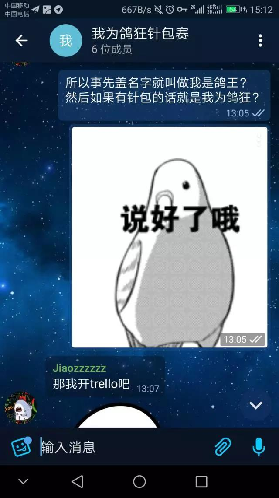
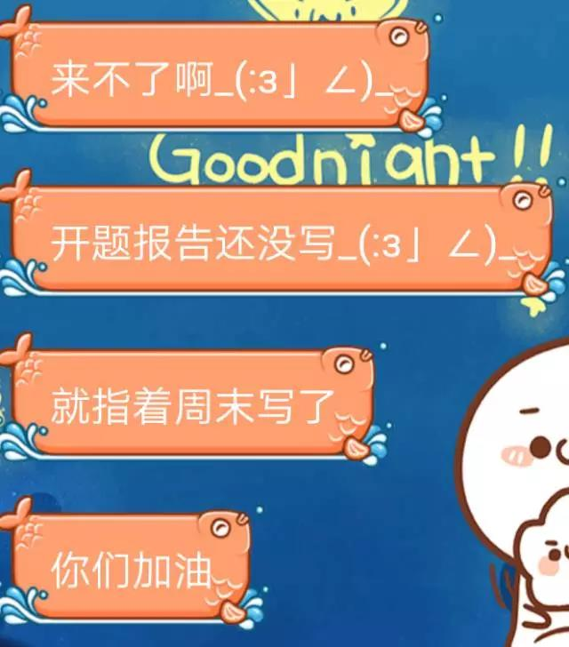
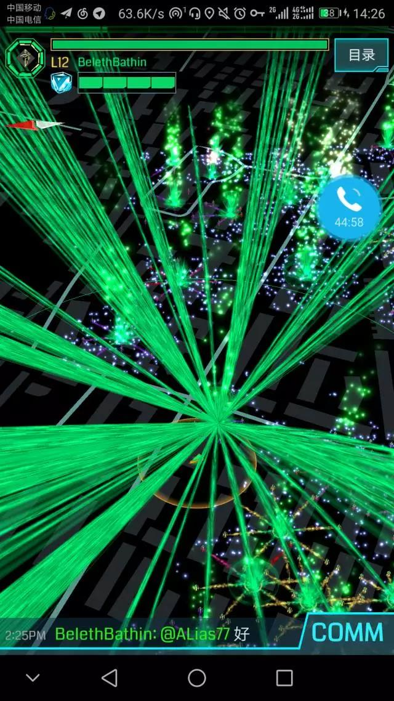
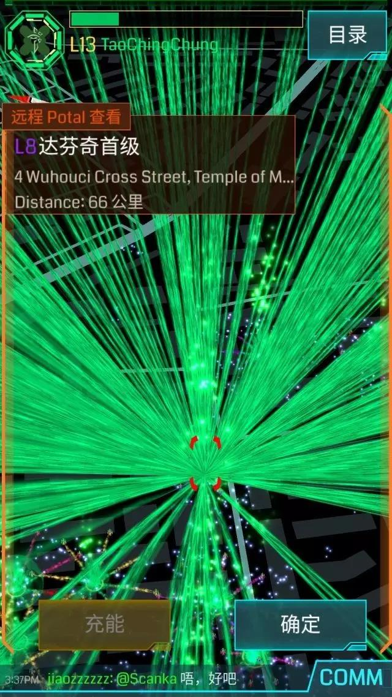
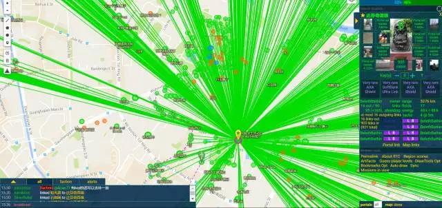
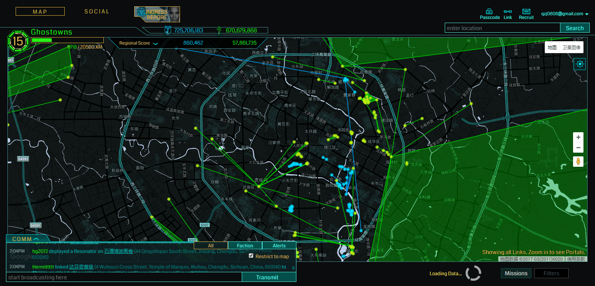

# 我为鸽狂针包赛

> **序**
>
> 这是一篇有声音的战报
>
> 一位不愿意透露姓名的成绿曾说过这么一句话：
>
> 我是鸽王，我为鸽狂。
>
> 这篇战报，用来纪念那些年，我们放过的鸽子。

## **第一章：鸽子的缘起** 

这几年来，成绿们不知道放过多少次鸽子了，鸽子表情包都在成都的各种群中飞舞。自从去年民院易主后，在飞的鸽子们都在准备一场浩大的针包。

燃鹅………

不用怀疑！这就是成绿的鸽力！

实际上鸽子们也不是不想回来，而是鸽子们飞不动啊。

虽说成都一直以来都以绿著称，但是每个阶段的活跃人数始终都只有那么多。（注：这被称为成绿鸽力第一定理：鸽量恒定） 去年11月，12月又逢双倍AP和英语四六级考试，原本能动的鸽子们又各自纷飞，准备着自己的鸽旅（注：这就是成绿鸽力第二定理——每当行动时，总有其他打散鸽群的事件出现）

就这样一个月，一个月，转眼来到了2017年的4月23日，成都的懒军们将成都覆盖在一片海洋之下，成绿的鸽子们，终于在这时，看到了针包的希望。

一曲激昂壮阔的鸽子旗永不落就此开始

5月1日，我是鸽王特别节目[【成都】当然是选择原谅他们呀](http://mp.weixin.qq.com/s?__biz=MzI3MDI5NzUzNQ==&mid=2247484881&idx=1&sn=20b717888c0e95d72ce20d9a6edcf65e&chksm=ead27501dda5fc17d365e65e7b9097832d73e2271a86d1bb94ce10e858edab8a7f1730c81403&scene=21#wechat_redirect)落幕之后，针包活动便被提上了议程。首先最重要的，便是招兵买马。

但是…………

成绿的天空，又多了几只自由飞翔的鸽子。

鸽子们的叫声，环绕着在行动前一天晚上的约饭桌，三日不绝。

## **第二章：鸽子的赞美诗**

当然，飞出去的鸽子，总有回头的时候。

几天没有回@Hermittttt 消息的银弹@SilverBullet 出现在5月6日起8现场。

行动当天上午，城西霸主@RJ51突然表示自己可以加入下午的针包计划，10点50分，昨日约饭时明确表明自己会咕咕咕咕的老玩具@oldtoy飞了一大圈后回心转意。郫县鸽王@swjtustalin 在行动前两小时终于来到民院拿到钥匙，并前往指定地点清障做准备。

就这样，这曲鸽子的赞美诗，拉开了序幕。

## **第三章：飞舞在天空的鸽**

长途搞大事的鸽子，一路总是那么坎坷。

随着14点03分，intel一声令下，各处的agent们都开始行动，顶点达芬奇首级身中数针，悬着的心一点点的放下。

但此时，语音中回报的情况，却让这放下去的心瞬间提到嗓子眼

339被挡

水池被挡

春熙路被挡

西南交大九里被挡

….

仿佛像商量好的一样，在行动命令下达的瞬间，蓝军@Zerot16在李家沱出线，挡住了西南交大至顶点的通道。观战中的车神@DuskPiper 挽狂澜于即倒，扶大厦于将倾，亲自前往李家沱帮助清障，打通了通道。

在intel的指挥和各处清障的努力之下，各区域之间迅速被联通，而此时毒保护已经过了47分钟。

15点14，link数超过成都上次针包记录

15点20，link数过750

15点37，link数破900

….

….

15点48分，蓝军空白@soraimanity毒掉顶点，针包收尾，数字停留在979条。

1小时42分，17人外勤，4人肉防，979条link，人均57条。

感谢各位，在这个5月所做的一切。

这首战歌，送给曾经鸽过的全成绿的鸽子们。

## **后记：**

多谢北京世纪佳缘行动的组织者@Rachmaninof 传授的人生经验

感谢菊妹在行动前一天发来的慰问（虽然我有想把你给拖出去丢进罐头的冲动）

多谢老蒙和各位菊苣在行动当天下午送给我的提前两天的生日祝福，嘻嘻

这段时间的filed和针包清障，给大家的游戏带来的不便，还望大家谅解。各位XJBL之王，现在就出门绿化成都吧！

## **活动人员名单**

**策划背锅：**@BelethBathin

**钥匙提供：**@LepiSac

**行动组：**@jiaozzzzzz @ZSOYT @Kamikiroc @oldtoy @DVlin @ccaoo @anna369 @hg2072 @plszer @jooyi @Alias77 @geekskynet @SilverBullet @RJ51 @LepiSac @swjtustalin @ZtwoM

**Intel组：**@BelethBathin @Hermittttt @jiaozzzzzz @ZtwoM

**肉防组：**@BelethBathin @Hermittttt @jiaozzzzzz @TimeAndFate

**强忍不射组：**@lazyyyy @DemaMinecraft @youdang @zmplpq

**嘴上说着不来身体却很诚实的：**@DuskPiper

还有上了滴滴半途叫司机调头的@Scanka

大家都是最棒的！

**听说西南地区只有成都搞过针包？大家快来挑战新纪录！**

