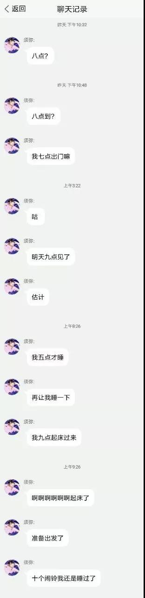
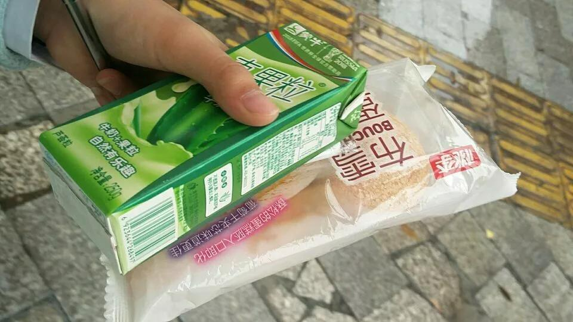
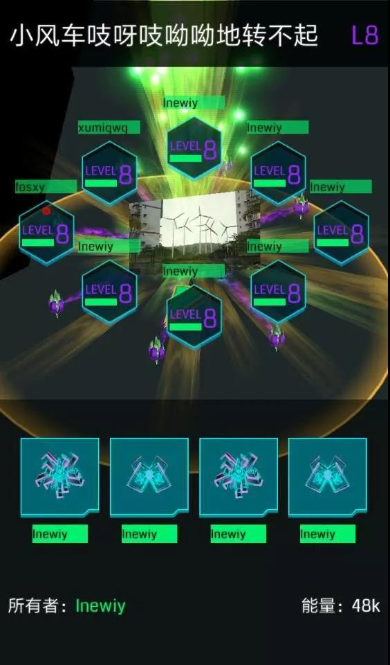
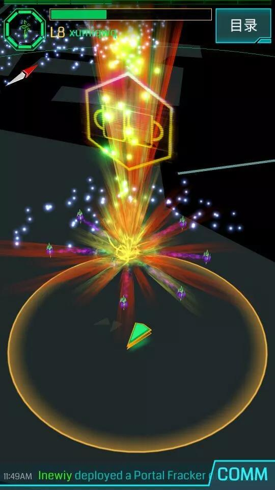

# 宜绿的艰难起八之旅

\(八po依然在~~宜宾的偏僻角落~~文章封面闪闪发光\)

大家好啊，我是宜绿猪猪**@fosxy**。这是我的第一篇战报也是宜绿的第一篇战报，写得不好望大家见谅。

众所周知，宜绿长期以来活动最为频繁的当属我、须弥@xumiqwq和咸鸽@Inewiy\(至于什么是咸鸽自己问ta去\)由于agent稀少以及po少难升级，宜宾一直没有出现过八po。在须弥和我接连升八之后

我们在大佬@2ubeneschamali的建议下建立了一个讨论组，准备起八。在经过九个多月的断断续续的插脚翻毒之后

我和@Inewiy终于把指定po弄成了只差两个八脚的7po。于是我们决定在国庆假期间叫上须弥起八。

在经过一系列的讨论之后\(其实是一群没有主见的人互相说不知道然后我实在是看不下去最后站出来决定的\)，我们决定在10月2日上午8点起八。

10月2日当天，我在吃过早餐之后打开了TIM结果看到了这个

当时我的心已经凉了半截，难不成@xumiqwq鸽王又要......

不出所料，鸽王果然还是那个鸽王，鸽子的职业素养被她体现得淋漓尽致。于是，我和@Inewiy在那个上午见证了鸽王一次教科书级别的咕咕咕

终于在经过了千\(gu\)辛\(gu\)万\(gu\)苦\(gu\)之后，@xumiqwq还是到了

\(这是须弥下车后买的早饭\)

后来又在经过一系列的艰难险阻之后\(比如须弥的GPS一直是飘的，后来@Inewiy给须弥开了热点才解决了\)，我们还是成功起到了八

之后就是上薯条摸八po的正常节奏\(本来只上了一个后来须弥没摸爽又上了一个\)，不过我们对这次的摸po体验极差\(实在是画不来五图，薯条时间又短\)

期间，在宜宾旅游@Lvens看见我们上薯条特地发来了慰问\(此处没有截图\)

摸完薯条之后，我们三人愉快的来到了@Inewiy家中点了一份干锅吃\(此处没有照片，当时忘记照了.......\)

最后还要向大家隆重介绍一下我们宜绿起八的特殊活动，那就是做作业！！！！！！！！没错，就是做作业，由于我们三人都是高三狗再加上须弥dalao回校要考试，于是我们把原本准备的打uno换成了做作业。\(可最后作业还是没有做成，都怪那该死的mirror和transister\)

于是，从2月11日起，历经233天\(才发现是233\)后宜宾拥有了第一个八po。

另外，可能很多agent不知道宜宾是哪儿。宜宾地处蜀地之南，是五粮液的酒厂就在宜宾，欢迎各位agent来宜宾玩@Inewiy请你们喝五粮液，我和须弥请你们吃燃面。

