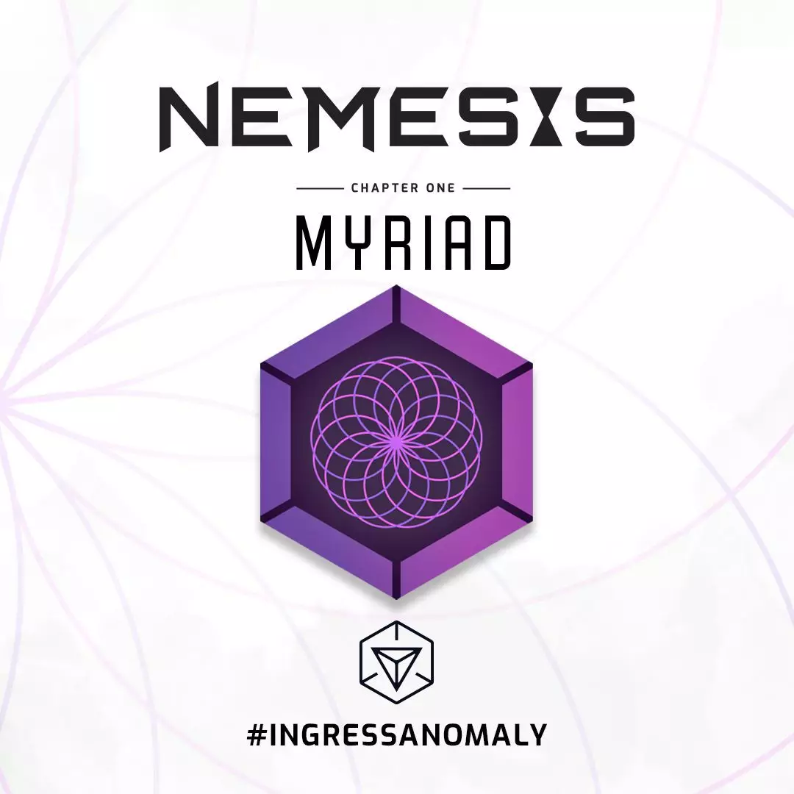

# 【成都】7.27釜山充电小记

**编者语：**  

Ingress Anomaly 是ingress官方举办的蓝绿阵营大规模对抗活动，又称为“XM异常”，一般而言，活动参与者均可在结束后获得Profile界面勋章（Medal）一枚。Anomaly 比赛的结果关系到ingress剧情的走向。每个赛季都会在选定的城市展开比赛，每一场次比赛都有一定的记分规则，综合得分高的阵营即为本场次胜利方，会获得一定的赛季积分。**不能抵达“战场”（活动现场）的玩家可以通过参与Intel指挥或远程充电的方式，对己方阵营进行支援。**活动信息会定期在官网（https://ingress.com/events/xm-anomaly）发布，想要参与远程充电的玩家需要提前通过本地区社群进行报名（不同地区会有差异）。

下一场Anomaly将在今年10.12展开，离中国大陆最近的战场为台湾桃园。

## 既然在家摸鱼，还不如花点时间随便写写总结拯救公众号好了！ 

经过一番激烈的讨论，此次充电的地点选在了宽窄巷子附近。两点十多分赶到后，我发现大佬们差不多齐了。虽然有这么多主机，但我还是想用windows打101！之后便是国际惯例，拿出bio卡找大佬们换卡+10分。脸盲越来越重了）大概是我充过最好充的一次了，随便点点点了几十次charge以后便开始了愉快的（看大佬们）摸鱼：

最后甚至下起了暴雨

此外等到了一位外地来（临时出现）的大佬@mem1ry，提前溜了的扶她@futureWL，隔山观望的猪猪@fosxy。 **那么成都8月的IFS你们又准备好了吗?是的，成都又有IFS了。还没有开牌子的各位，抓紧时间报名咯~**

> 🔸 文化公园场
>
> ⏰ 时间：8 月 3 日 14:00
>
> 📍 签到portal：这算廊桥不遗梦
>
> 🔗 rsvp链接：想要临水廊榭？

> 🔹 东郊记忆场
>
> ⏰ 时间：8 月 3 日 14:00
>
> 📍 签到portal：墙上的乐队
>
> 🔗 rsvp链接：想要阴凉走廊？

> 详情请加入 telegram频道 @ChengduIFS 以获得活动通知！
>
> 希望大家能一起度过一个愉快的周末！

